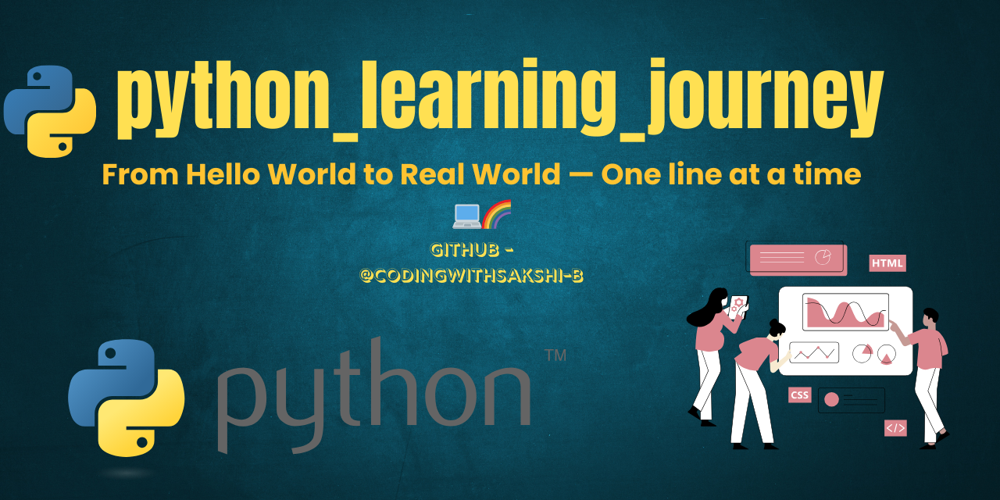

# python_learning_journey

# 💖 Welcome to My Python Coding World

> “Every bug I fix and every line I write takes me closer to the coder I dream to be.” – Sakshi 💫

Hi! I'm Sakshi, currently learning Python step by step with full dedication and excitement 😄  
This repo is like my second home where I store all my notes, practice questions, and cute mini projects 🏠✨  
Har din thoda thoda seekh ke, ek bada coder banna hai 👩‍💻🔥

---

## 📌 About This Repository

Hey! I’m **Sakshi**, and this repo is my Python learning diary 📒✨  
From the *very first variable* to *mini magical projects*, this space holds every step of my journey.  
Powered by curiosity, VS Code, and caffeine ☕, I’m building my own coding kingdom one concept at a time 👩‍💻👑

---

## 🗂️ Folder Overview

📁 notes/ → Lecture-wise handwritten code notes 📝  
📁 practice_questions/ → Python questions solved by me ✨  
📁 mini_projects/ → Small but cool real-life projects 💻  
📁 assignments/ → Practice tasks & mini challenges 🎯  
📁 resources/ → Cheat sheets, useful PDFs, and more 🧠  
📁 readme_assets/ → Images & banners used in README 🌈

---

## 📚 What You'll Find Here

- 🧠 **Lecture-wise Notes** – Clear handwritten-style notes for each lecture  
- ✅ **Practice Questions** – Beginner-friendly problems and solutions  
- 💻 **Mini Projects** – Simple apps to apply what I've learned  
- 🗂️ **Resources Folder** – Handy links, references, and cheatsheets  
- 📝 **Challenge Sheets & Weekly Assignments** – Pre-lecture tests & solution sets  
  📁 `assignment/functions_recursion_challenge.py`  
  📁 `practice_questions/functions_recursion_challenge_solution.py`  
- 📌 **Learning Source** – https://www.youtube.com/playlist?list=PLGjplNEQ1it8-0CmoljS5yeV-GlKSUEt0

---

## 🚀 My Progress

| 📘 Lecture |📚 Topics Covered                          |📚 Status  |
|-----------|-------------------------------------------|------------|
| 1-4       | Basics, Variables, Data Types, I/O        | ✅ Done     |
| 5         | Loops (for, while, break, continue, range)| ✅ Done     |
| 6         | Functions, Recursion                      | ✅ Done     |
| 7         | File Handling, open/read/write/with/os    | ✅ Done     |
| 8         | Coming soon...                            | 🕓 Upcoming |

---

📅 **Started on:** April 3, 2025  
📍 **Goal:** Build confidence in Python & start creating real-world projects after Semester 1!

---

## 🚀 Tools & Tech

- 💻 Language: Python (obviously 😎)  
- 🎬 Tutorial: Shraddha Khapra’s Beginner-Friendly Playlist  
- 🧠 IDE: VS Code  
- 🌍 Hosted on: GitHub  

---

## 🧁 Why I Made This Repo

- To track my growth 📈  
- To build my concepts stronger 💪  
- To help other beginners too 🤝  
- And because coding is honestly… super fun! 💜

---

## 🌟 Featured Work So Far

- ✔️ Loop Notes with examples  
- ✔️ Student Info Dictionary Project 📘  
- ✔️ Smart Number Checker (if-else logic based) 🎯  
- ✔️ List Toolkit (Python list manipulations) 🧺  
- ✔️ Chef Fun Coding Warm-Up (5 cute tasks) 🍳  
- ✔️ Flexible Calculator with Default Parameters 🧮  
- ✔️ Challenge Sheet + Solutions (Functions & Recursion) 🧠📝

---

## 🤝 Let's Connect!

- 💻 [GitHub](https://github.com/codingwithsakshi-b)  
- 💌 [Gmail](mailto:studystudy7867@gmail.com)  
- 🐍 Follow my journey and feel free to explore, suggest, or learn along!

---

## 🫶 Made with love

Made with 💖 by **Sakshi** a.k.a. `codingwithsakshi-b`  
Let’s grow, code & glow together ✨  

> “Learning Python is not just about syntax… it's about building something magical 🪄.”  

